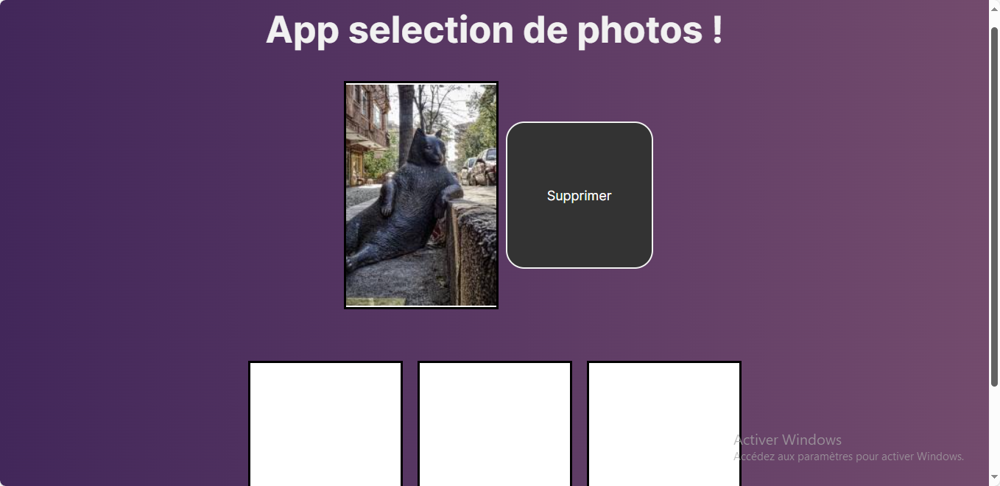

# 🖼️ Drag & Drop Photo Selector

A dynamic photo selection tool that allows users to drag and drop up to 3 images generated randomly from the [loremflickr](https://loremflickr.com) API. Users can also delete selected photos by dragging them into a "Delete" zone.

## ✨ Features

- 📸 Fetches random images from `loremflickr` API  
- 🖱️ Drag & drop functionality for selecting photos  
- ✋ Limit of 3 selected images at a time  
- 🗑️ Drag images to a "Delete" box to remove them  
- 🎯 Smooth UI feedback on interactions

## 🛠️ Tech Stack

- HTML  
- CSS  
- JavaScript  
- [loremflickr API](https://loremflickr.com)

## 📸 Preview

## 🎓 Learning Source
This project was built while following a course on Udemy as part of a training to practice handling cookies in JavaScript.

## 🚀 Getting Started

- Live Site - [Drag & Drop](https://drag-drop-lake.vercel.app/)

## 👨‍💻 Author

### Grace Ariane
Frontend developer passionate about creative coding tools ✨
- linkedIn - [Grace Ariane Tchoukeu](https://www.linkedin.com/in/grace-ariane-tchoukeu)
